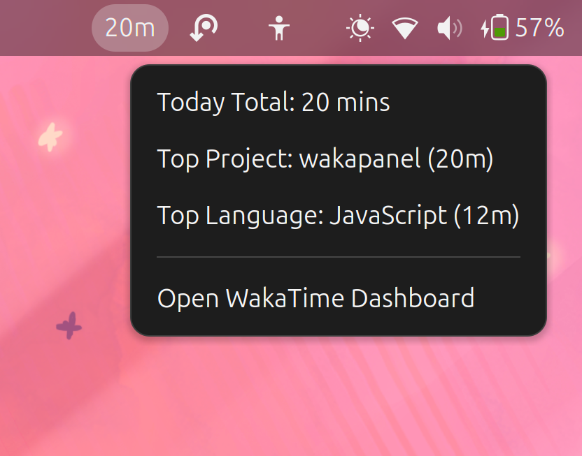

# WakaPanel

A minimalist GNOME Shell extension that displays your WakaTime coding statistics directly in your top panel.


## Features

- ⏱️ **Real-time Stats**: Shows total coding time in the panel
- 📊 **Time Range Selection**: Switch between Today, 7 Days, and 30 Days views
- 💻 **Languages Chart**: Visual breakdown of programming languages used
- 📁 **Projects Chart**: See time distribution across projects
- ✏️ **Editors Chart**: Track which editors are being used (optional)
- 🔄 **Auto-refresh**: Configurable refresh interval (1-60 minutes)
- 🌐 **Self-hosted Support**: Compatible with WakaTime and Wakapi
- ⚙️ **Customizable**: Toggle chart visibility in preferences
- 🎨 **Minimalist Design**: Clean, unobtrusive interface

## Screenshots

### Panel View



### Preferences


## Installation

### From Source (Manual Installation)

1. Download or clone this repository:

   ```bash
   git clone https://github.com/Anoop130/wakapanel.git
   cd wakapanel
   ```

2. Copy the extension to GNOME extensions directory:

   ```bash
   cp -r wakapanel@rsim ~/.local/share/gnome-shell/extensions/
   ```

3. Compile the settings schema:

   ```bash
   glib-compile-schemas ~/.local/share/gnome-shell/extensions/wakapanel@rsim/schemas/
   ```

4. Enable the extension:

   ```bash
   gnome-extensions enable wakapanel@rsim
   ```

5. Restart GNOME Shell:
   - **X11**: Press `Alt+F2`, type `r`, and press Enter
   - **Wayland**: Log out and log back in

### From ZIP File

1. Download the latest `wakapanel@rsim.shell-extension.zip` from [Releases](https://github.com/Anoop130/wakapanel/releases)
2. Install using GNOME Extensions app or command line:
   ```bash
   gnome-extensions install wakapanel@rsim.shell-extension.zip
   gnome-extensions enable wakapanel@rsim
   ```

## Configuration

1. Open Extension Settings:
   - Right-click the WakaPanel icon in the top bar → Settings
   - Or use: `gnome-extensions prefs wakapanel@rsim`

2. Enter your WakaTime API Key:
   - Get it from [wakatime.com/settings/api-key](https://wakatime.com/settings/api-key)

3. Configure display options (optional):
   - Toggle Languages/Projects/Editors charts visibility
   - Set default time range (Today, 7 Days, or 30 Days)
   - Adjust refresh interval (default: 10 minutes)

## Usage

Once configured, WakaPanel will:

- Display total coding time in the top panel (e.g., "2h 15m")
- Show detailed charts in the dropdown menu:
  - **Time Range Selector**: Switch between Today, 7 Days, or 30 Days
  - **Languages**: Bar chart showing language usage with percentages
  - **Projects**: Visual breakdown of time spent per project
  - **Editors**: Track editor usage (can be disabled in preferences)
- Update automatically based on the configured refresh interval
- Provide a quick link to the WakaTime dashboard

## Requirements

- GNOME Shell 45, 46, or 47
- WakaTime account and API key
- Active WakaTime integration in your code editor (see [wakatime.com/integrations](https://wakatime.com/integrations))

## Compatibility

- ✅ WakaTime (wakatime.com)
- ✅ Wakapi (self-hosted)
- ✅ Any WakaTime-compatible API

## Development

### Setting Up Development Environment

```bash
# Clone the repository
git clone https://github.com/Anoop130/wakapanel.git
cd wakapanel

# Create symlink to extensions directory (recommended for development)
ln -s $(pwd)/wakapanel@rsim ~/.local/share/gnome-shell/extensions/wakapanel@rsim

# Compile schemas
glib-compile-schemas wakapanel@rsim/schemas/

# Enable extension
gnome-extensions enable wakapanel@rsim
```

### Making Changes

After editing code:

```bash
# Disable extension
gnome-extensions disable wakapanel@rsim

# Recompile schemas (if schema.xml was modified)
glib-compile-schemas ~/.local/share/gnome-shell/extensions/wakapanel@rsim/schemas/

# Enable extension
gnome-extensions enable wakapanel@rsim

# Restart GNOME Shell
# X11: Alt+F2 → type 'r' → Enter
# Wayland: Log out and log back in
```

### Viewing Logs

```bash
# View all GNOME Shell logs
journalctl -f -o cat /usr/bin/gnome-shell

# Filter for WakaPanel logs
journalctl -f -o cat /usr/bin/gnome-shell | grep -i waka
```

## Troubleshooting

### Extension not showing

- Make sure you've enabled the extension: `gnome-extensions enable wakapanel@rsim`
- Check logs: `journalctl -f -o cat /usr/bin/gnome-shell`

### "API Key Missing" error

- Open preferences and ensure your API key is entered
- Verify your API key at [wakatime.com/settings/api-key](https://wakatime.com/settings/api-key)

### Settings not saving

- Ensure schemas are compiled:
  ```bash
  glib-compile-schemas ~/.local/share/gnome-shell/extensions/wakapanel@rsim/schemas/
  ```
- Disable and re-enable the extension:
  ```bash
  gnome-extensions disable wakapanel@rsim
  gnome-extensions enable wakapanel@rsim
  ```
- Restart GNOME Shell (X11: Alt+F2 → 'r', Wayland: log out/in)

## Contributing

Contributions are welcome! Please feel free to submit a Pull Request.

## License

This project is licensed under the MIT License - see the [LICENSE](LICENSE) file for details.

## Credits

- Built with ❤️ for the GNOME community
- Powered by [WakaTime](https://wakatime.com)

## Support

If you find this extension useful, consider:

- ⭐ Starring the repository
- 🐛 Reporting issues
- 🔀 Contributing improvements

---

**Note**: This is an unofficial extension and is not affiliated with WakaTime.
